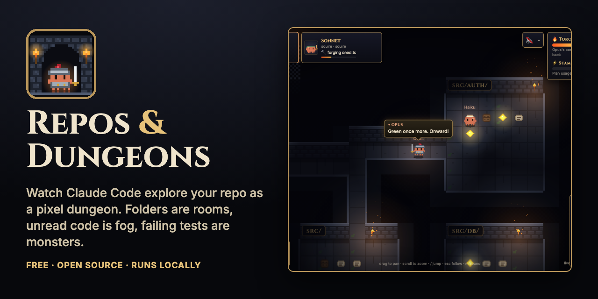
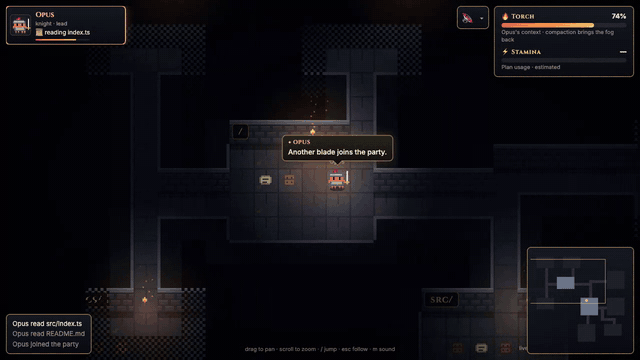
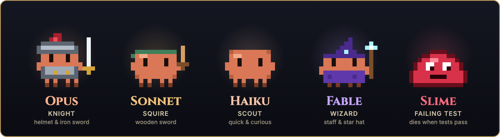
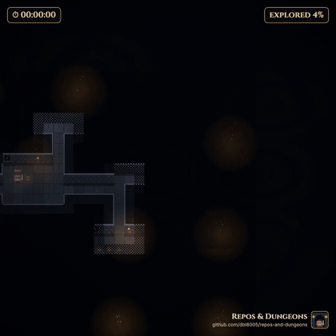
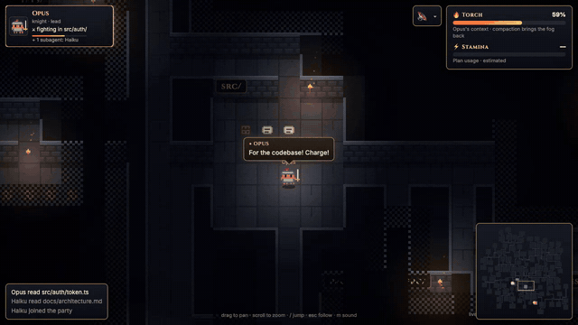

<p align="center">
  
</p>

<p align="center">
  <a href="https://github.com/dbl8005/repos-and-dungeons/actions/workflows/ci.yml"></a>
  <a href="LICENSE"></a>
  
  
</p>

<h3 align="center">Your coding agent's session, as a live roguelike.</h3>
<p align="center">Folders are rooms · unread code is fog · failing tests are monsters · your agents are the party</p>

<p align="center">
  <a href="#-quick-start"><b>Quick start</b></a> ·
  <a href="#-your-repo-becomes-a-dungeon">How it maps</a> ·
  <a href="#-meet-the-party">The party</a> ·
  <a href="#-share-a-timelapse">Timelapse</a> ·
  <a href="#-videos">Videos</a> ·
  <a href="#-privacy">Privacy</a>
</p>

<p align="center">
  
</p>

## ⚡ Quick start

You need **Node 20+** and **[Claude Code](https://claude.com/claude-code)**. In any repo where you use Claude Code:

```bash
npx github:dbl8005/repos-and-dungeons
```

A browser tab opens with **your repo's dungeon**, and every Claude Code session running in that repo walks in as a hero — live. The first run takes about a minute while it builds; after that it starts in seconds.

No agent running right now? Watch the built-in demo:

```bash
npx github:dbl8005/repos-and-dungeons --demo         # a small app
npx github:dbl8005/repos-and-dungeons --demo-large   # a ~2,500-file monorepo
```

## 🗺 Your repo becomes a dungeon

The map is built from your actual file tree, and it's deterministic: the same repo always gives the same dungeon.

| When your agent… | …in the dungeon |
|---|---|
| 📜 reads a file | the hero walks there, the fog lifts, the crate opens into a scroll |
| 🔨 edits or creates a file | the tile is forged into a glowing gem, sparks fly |
| 🔦 searches (Grep / Glob) | a torch flash |
| 🟥 runs failing tests (vitest, jest, pytest, go, …) | slimes spawn in the failing file's room — and taunt you |
| ✅ gets the tests green again | the slimes die, gold bursts, victory fanfare |
| 🔥 fills its context window | the torch meter burns down; compaction brings the fog back |
| 🧭 spawns subagents | new party members walk in |

The fog is the useful part: at a glance you can see which parts of the codebase your agent **never looked at**.

## 🧙 Meet the party

<p align="center"></p>

Every model gets its own Claude. And they **talk**: heroes comment on what they're doing in a D&D voice —

> **OPUS** — *"By Helm's beard! A bug in token.ts betrays us."*
> **HAIKU** — *"Architecture here's well-drawn, but whoever penned these sessions was surely mad."*
> **SLIME** — *"Your tests are MINE!"*

Lines are written live by Haiku through your own Claude Code login (about one short call per hero every 15 seconds while active, which counts toward your plan usage), plus built-in lines for big moments. Prefer quiet? `--no-narrator`.

🔊 **Sound is off by default.** Click the speaker or press `M` for dungeon music and effects — the music shifts to drums while monsters are alive.

## 🎬 Share a timelapse

<table>
<tr>
<td width="46%" align="center"></td>
<td>

Click **▶ Timelapse** to replay everything since you started, squeezed into 30 seconds — idle stretches are skipped and the camera follows the exploration.

Click **⤓ Export** to save it:

- **MP4 or GIF**, square (for social) or wide
- **15 / 30 / 60 seconds**
- session clock, explored %, speech bubbles and a small watermark
- **Hide folder names** turns every room into "Room 1, Room 2…" before you share
- optional sound track

Everything renders in your browser. Sessions are also recorded to `~/.repos-and-dungeons/recordings/` (private to your user).

</td>
</tr>
</table>

## 🏰 Built for big repos

<table>
<tr>
<td>

A huge monorepo still makes a readable map:

- at most **400 rooms** — the biggest folders split first, the rest fold into alcoves
- room size grows with the **square root** of the file count
- only what's on screen is drawn, at three zoom levels
- press **`F`** for the overview with explored % per room, **`/`** to jump to any folder

**100,000 files map in under a second and render at 60 fps.**

</td>
<td width="52%" align="center"></td>
</tr>
</table>

## 🎥 Videos

| | Clip | Length |
|---|---|---|
| ▶ | [**A live session**](https://github.com/dbl8005/repos-and-dungeons/raw/main/assets/media/hero.mp4) — heroes read, forge, fight slimes and banter | 18 s |
| ▶ | [**An exported timelapse**](https://github.com/dbl8005/repos-and-dungeons/raw/main/assets/media/timelapse.mp4) — made with the built-in exporter | 30 s |
| ▶ | [**A big monorepo**](https://github.com/dbl8005/repos-and-dungeons/raw/main/assets/media/big-repo.mp4) — overview, then diving into the party | 14 s |

## 🎮 Controls

| Input | Action |
|---|---|
| drag · scroll | pan · zoom |
| `F` | overview of the whole dungeon |
| `/` | jump to a folder |
| `Esc` | follow the action again (or stop a timelapse) |
| click a hero card | follow that hero |
| `M` | sound on / off |

```text
repos-and-dungeons [repo-path] [--port n] [--no-open] [--no-narrator] [--demo | --demo-large]
```

## 🔒 Privacy

Everything runs on your machine.

- The server listens on `127.0.0.1` only and needs a random key in the URL.
- It reads your Claude Code transcripts (`~/.claude/projects`) and your file **list** (`git ls-files`) — **never file contents**.
- Game events keep file paths and test names only: no command text, tool output or file contents.
- The narrator sends Haiku only event kinds, cleaned file names and test counts.
- Exports render in your browser and are only saved where you download them.

## ⚙️ How it works

Repos & Dungeons tails Claude Code's session transcripts (no hooks or settings needed), turns each line into game events, and streams them over a WebSocket to a [PixiJS](https://pixijs.com) renderer. The art and music are generated in code. The full design lives in [docs/SPEC.md](docs/SPEC.md).

## 🧭 Roadmap

- [ ] [`/dungeon` command as a Claude Code plugin](https://github.com/dbl8005/repos-and-dungeons/issues/1)
- [ ] [Live usage-limit stamina bar](https://github.com/dbl8005/repos-and-dungeons/issues/2)
- [ ] [npm release for instant `npx repos-and-dungeons`](https://github.com/dbl8005/repos-and-dungeons/issues/3)
- [ ] [Replay past sessions](https://github.com/dbl8005/repos-and-dungeons/issues/4)
- [ ] [Other agents (Codex, …)](https://github.com/dbl8005/repos-and-dungeons/issues/5)

Ideas welcome in [Discussions](https://github.com/dbl8005/repos-and-dungeons/discussions) and [Issues](https://github.com/dbl8005/repos-and-dungeons/issues).

## 🛠 Develop

```bash
npm install
npm test               # unit tests
npm run test:e2e       # browser tests (uses your GPU)
npm run build && node dist/cli.js --demo
```

## License

MIT · Not affiliated with Anthropic; Claude is a trademark of Anthropic · All art and sound are made in code for this project.

<p align="center"></p>
